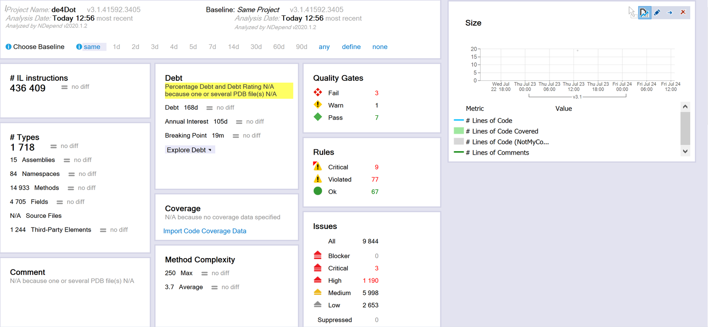
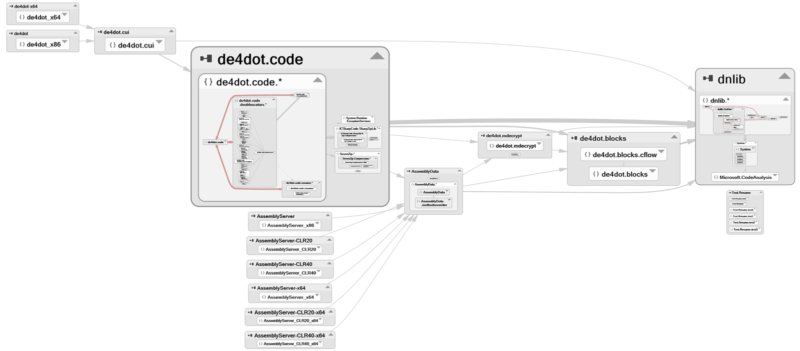
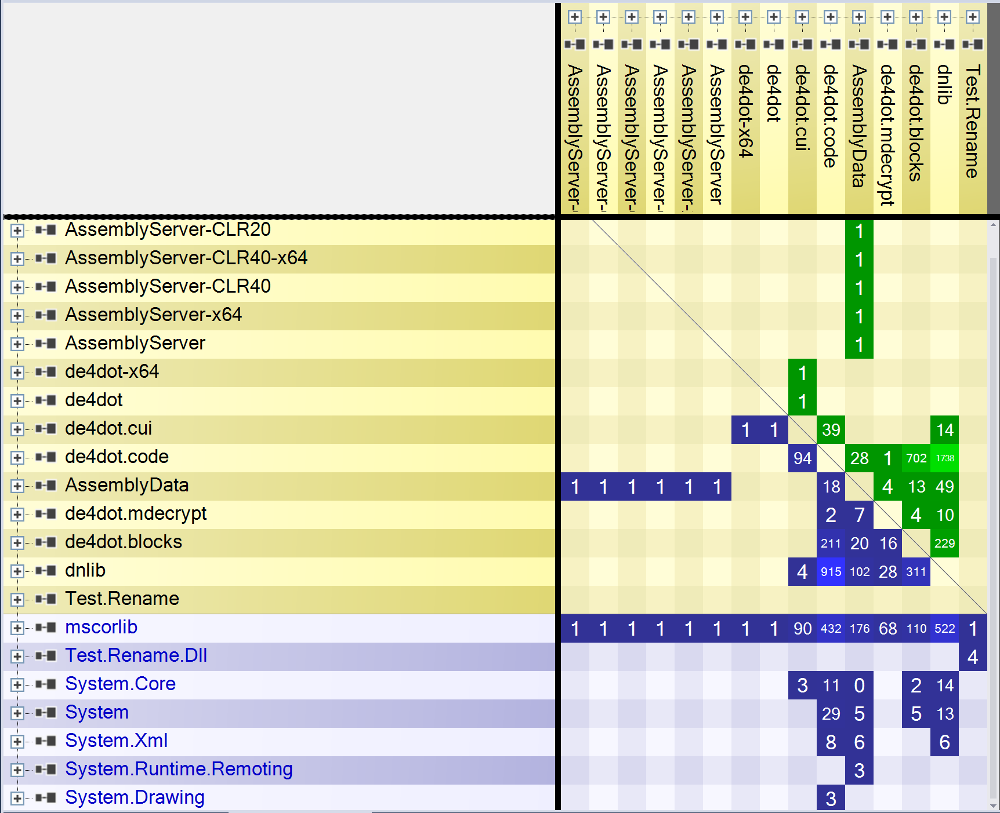
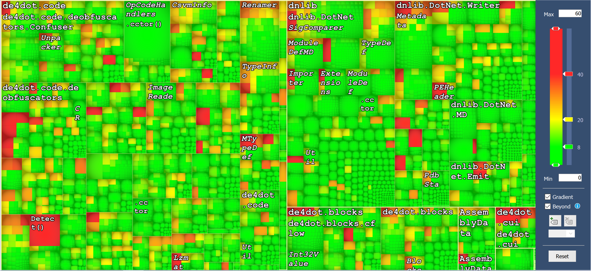

# nDepend - Revisisted

Contrary to Sheldon, my mother hadn’t me tested but I always considered myself a left-brainier. 
I like numbers, charts and all sorts of statistics. I like not only to watch them but it’s even better when I can use them to improve my work. And of course I like tools that can produce and show such statistics to me.

One of such tools is nDepend. What it is, can be described as, a static code analyzer. It contains a lot of rules and can check your code against them quickly and efficiently producing  a lot of reports and analytic data. But it’s more just a dumb tool producing data.

I like to think of nDepend as a guard that keeps me on track with the quality of my code. It is especially useful when we are developing project alone or with inexperienced team. In such cases we don’t enough brains to pick from to verify that our technical decisions are valid. nDepend can provide us metrics and charts so that we have something to back-up our decisions. 

nDepend is great tool on its own but it can really shine when we don’t even have to use it to get the information we care about. It can be used as a CI pipeline step so that after each commit the same rules are checked and we get a nice report about new violations or, and that should be our goal, that our code improved. 

If we have an existing project (and to be honest - not that often we work on greenfield) it might be intimidating to start using such tool as we will get a ton of errors and we will not even know where to start improving. What’s is nice in nDepend is that we can set a baseline and only track delta. With such approach we are stating that we no longer want to have bad code so from now on we don’t want to introduce bad patterns and bad quality code.

How does nDepend knows what is good and what is bad quality code? Well it has 11 quality gates and over 150 rules to check. Quality gates are a bit broader terms that encompass things like ‘is any critical rule violated’ or ‘is new technical debt added’. Rules are a bit lower-level concept and check a specific technical thing like cyclomatic-complexity or some object-oriented patterns.

Back to technical debt, that I’ve mentioned few lines before. nDepend can also provide us with time-based number for those. I think this is ingenious idea as it speaks (at least to me) much better than just the information of how many issues I do have in my code base. Having a concrete value - let’s say “2d 6h of effort to fix technical debt” - gives an estimation if our technical debt is still manageable or not. Having few hours of issues to fix might not be a big deal but if this value becomes days or even months we should start paying attention. 

But the best concept of nDepend is the CQLinq. Each rule that nDepend is running is not hard coded thing that is difficult to modify or to even see what’s exactly being checked. They are provided in the tool as a text. They are available to read and, even more astonishing, to modify to suit our needs. So if for us, we want to be warned if cyclomatic complexity is higher than default 20 (spoiler alert! we should maybe go lower) we can do that.
 
CQLinq is like LINQ to Objects (hence the name) so that anyone how is familiar with the latter will not have any issues with the former. Just to add great ot greatness - build-in editor has code-completion. Wow.

Let’s look at some graphs now. The default one would be Dependency Graph - on this one, we can see how our assemblies, and if we zoom-in classes, are dependent on each other. Using this graph we can easily spot some weird connections between modules. On a side note - the graph is blazing fast, even for large projects/solutions.

Dependency Matrix is the next one we will look at. It provides the same information as Dependency Graph but in different form. Here we have a table and in rows and columns are our assemblies (and .net framework/.net core ones). A value on the crossing of a row and column means is that there are as many dependencies between the two as the numer states. The matrix can be more easy to use than the graph if we are dealing with big project and solutions as we have more information provided in the same space. 

Looking at this matrix, we can also identify specific things that code posses. It can allow to quickly visualize that we have layered architecture, dependency cycle or if the SRP is broken.

Metrics is next one that has a purpose of visualizing pure numerical value in a nice, more appealing (and thus readable) way. We can select what levels we can work on (assembly, namespace, type - or more granular like field or method) and what type of metric we will be looking at. It is different depending on the level but for example we can look at abstractness of our assemblies or how meny methods are in our types and if that correlates with Lack of cohesion of our type.

Also, I didn’t mention that but nDepend doesn’t need your code to do its job. It can extract all the necessary information from binaries and PDBs.

To sum up, nDepend is an awesome tool, if quality of your code-base is important. It is especially important if you don’t have a lot of experience of producing good quality code or not many senior devs to discuss your contribution. It’s a guard that tells you you did something wrong but doing that having your best interest at heart. I would say it’s as essential tool as a good IDE. 

nDepend for testing was provided by the ZEN PROGRAM LTD.